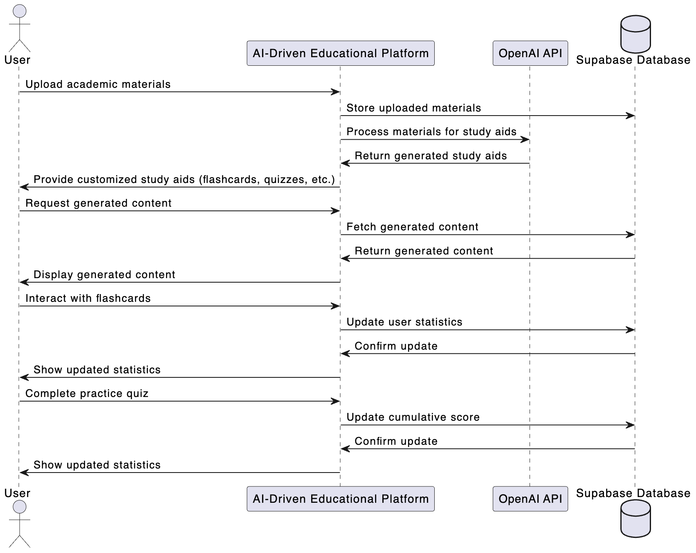
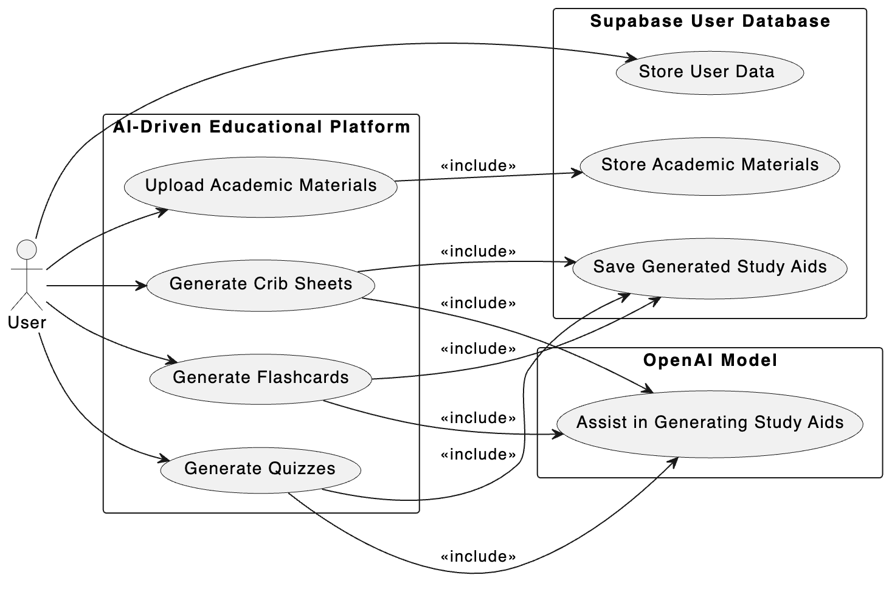

# Sudolphin Project Report

### Team 1 - Gal Ovadia, Rana Myneni, Timothy Copeland, Jacob Kotzian, Matthew Perry, Mae Frank

## Introduction/Background (10 points)

The project is an AI-driven educational platform where users can upload their academic materials such as lecture slides, practice exams, homework assignments, syllabi, etc.
Utilizing OpenAI's API, the platform processes the uploaded materials to generate customized study aids, including flashcards, practice questions, quizzes, and concise summary sheets (crib sheets).
This platform aims to enhance user learning experience by providing personalized and adaptive study resources.

### Related Work

Many platform exist allowing the generation of specific educational resources such as flashcards (Revisely, Memrizz, Anki plugins, etc), quizzes (Quizgecko, Quizlet, Jotform, etc), and summary sheets (Mymap, Summarizer, etc).
However, few of these allow generation of all these resources in one place or the ability to manage files.
Good AI generation requires a lot of context, which is why course material management (file upload, course creation, etc) is a key feature of our platform.


## Software Technologies (15 points)

### Frontend & Backend Tech Stacks

**Framework**: Next.js

Next.js is a powerful React framework that supports both frontend and backend development through its server-side rendering and API routes capabilities.
This unified approach simplifies development, ensures consistency across the application, and enhances performance and SEO.

**Language**: TypeScript

TypeScript provides static typing, which helps catch errors during development, improves code maintainability, and enhances collaboration among developers.

**Styling**: Tailwind CSS 

Tailwind CSS offers utility-first CSS for rapid UI development, while Styled Components allow for modular and scoped styling within components.

**Backend Services**: Supabase

Supabase provides a comprehensive suite of backend services, including authentication, database management, and file storage.
Its seamless integration with Next.js and TypeScript makes it an ideal choice for us.

**Backend Services**: Supabase Auth

Supabase Auth provides secure user sign-up, login, and session management.

**Database**: Supabase PostgreSQL

PostgreSQL is a powerful, open-source relational database system that integrates smoothly with Supabase, offering robust data management capabilities.

### AI Tools

OpenAI's API:

Justification: OpenAI’s API will be used to generate study materials such as flashcards, practice tests, problems, and crib sheets based on user-uploaded content.

GitHub Copilot: 

Justification: Copilot proved extremely powerful in the implementation stage for Project 1. Having the option to simply autocomplete lines instead of having to prompt an LLM, which may be few-shot, sped up the development process significantly, and we expect that Copilot will be similarly effective while coding for Project 2. 

ChatGPT:

Justification: ChatGPT was very productive in Project 1 when assisting with tasks that were more involved. It significantly helped decrease the time needed for debugging, as this is a situation that requires additional context, and could generate boilerplate code and unit tests in seconds with just one-shot.

Cursor:

Justification: Cursor was a standout tool during the development of Project 1 because of its context awareness and its capability to query our codebase. We look forward to continuing to use Cursor in project 2.

Windsurf:

TODO: Add Windsurf Justification

## Requirements (20 Points)

### Minimum Marketable Features (MMFs)

1. Create and delete classes: Users can create and delete classes they are enrolled in
2. Educational material upload: Users can upload and delete their educational materials in PDF format
3. AI-Generated study resources: Users can generate personalized study aids from uploaded materials.
4. Mastery statistics: A centralized hub for users to interact with and manage their study materials.
5. Sharing: Users can natively export the generated materials via iMessage, Airdrop, etc.

See Functional Requirements for more information on each MMF.

### Functional Requirements
1. User Authentication and Profile Management

- User Registration: Users must be able to create an account using their email and a secure password.
- Secure Login/Logout: Users must be able to log in and out securely, with session management handled appropriately.
- Password Recovery: Users should have the ability to reset their password in case they forget it.

2. Course Creation and Management

- Create Courses: Users can create new courses or classes they are enrolled in, specifying course names and details.
- Delete Courses: Users can delete existing courses that they no longer need.
- Course Listing: Users can view a list of all their courses on a personalized dashboard.
- Edit courses: Users can customize the view of the courses
  
3. Educational Material Upload

- File Upload: Users can upload educational materials in PDF format to specific courses.
- File Deletion: Users can delete previously uploaded materials.
- Multiple File Support: The system should support uploading multiple files at once.
  
4. AI-Generated Study Resources

- Generate Study Aids: Users can request the generation of personalized study aids based on their uploaded materials.
- Types of Study Aids: The platform can generate flashcards, practice questions, quizzes, and summary sheets.
- Customization: Users can select which type of study aid they want to generate for each material.

5. Mastery Statistics

- Progress Tracking: Users can view statistics on their performance with the study aids.
- Performance Metrics: The platform provides insights into areas of strength and improvement.
- Historical Data: Users can track their progress over time.

6. Sharing and Exporting

- Export Materials: Users can export generated study aids.
- Sharing Options: Exported materials can be shared via iMessage, AirDrop, email, and other platforms.
- Format Compatibility: Ensure that exported files are in formats compatible with common devices and applications.

### Non-Functional Requirements

1. Cross-Browser Compatibility
- The application must function seamlessly on all modern web browsers, including Chromium-based browsers (e.g., Google Chrome), Firefox, and WebKit-based browsers (e.g., Safari).

2. Performance
- Responsiveness: The user interface should respond to user actions within 200 milliseconds.
- Processing Time: The system should process uploads and generate study materials within a reasonable time frame (ideally under 2 minutes per request).
  
3. Scalability
- The platform must handle multiple concurrent users without performance degradation.
- The architecture should support future enhancements and increased user load.
  
4. Security
- Data Protection: User data must be stored securely, with appropriate encryption.
- Authentication Security: Implement measures to protect against unauthorized access.

5. Usability
- User-Friendly Interface: The platform should be intuitive and easy to navigate.
- Consistency: Maintain a consistent look and feel throughout the application.
  
6. Reliability
- Uptime: The system should have high availability, aiming for 99.9% uptime.
- API Availability: The OpenAI API should fail for < 5% of requests.
- Error Handling: Provide informative error messages.

### Requirement Priority

After coming up with the idea for our project, the MMFs were easy to identify as these were the core aspects of our service. We especially prioritized
the first three MMFs, since these encapsulated the core requirements. If users couldn't create a class, upload material, and generate AI content, this 
app would not be viable at all as a product. Therefore, we focused on these MMFs first. The statistics and sharing MMFs, while still important to our app,
were not considered as crucial as the other three, as these are nice-to-have but not mandatory. 

## Design (30 Points)







## Design Patterns Implementation (30 points)

### Factory Method

The Supabase client configuration is setup once in a factory method, client code call methods of this created object.
This ensures consistent instantiation of Supabase client across all calling classes, while being open to modification (secrets update) and the ability to have multiple instances of the database (scalability for the future).

```typescript
export const createClient = async () => {
  const cookieStore = await cookies();

  return createServerClient(
    process.env.NEXT_PUBLIC_SUPABASE_URL!,
    process.env.NEXT_PUBLIC_SUPABASE_ANON_KEY!,
    {
      cookies: {
        getAll() {
          return cookieStore.getAll();
        },
        setAll(cookiesToSet) {
          try {
            cookiesToSet.forEach(({ name, value, options }) => {
              cookieStore.set(name, value, options);
    ...
```

### Proxy

Next.js's architecture uses a middleware to protect routes from unauthorized access.
This middleware works by redirecting unauthorized requests for protected routes or resources to the login page.
We used this to protect and isolate the dashboard and course pages from unauthorized access, while abstracting the authentication logic from the client-side code.

```typescript
export async function middleware(request: NextRequest) {
 return await updateSession(request);
}

export const updateSession = async (request: NextRequest) => {
   ...
   if (request.nextUrl.pathname.startsWith("/protected") && user.error) {
     return NextResponse.redirect(new URL("/sign-in", request.url));
   }
   if (request.nextUrl.pathname === "/" && !user.error) {
     return NextResponse.redirect(new URL("/protected", request.url));
   }
   ...
```

### Command 

All of the database operations and frontend updates for the dashboard's course logic are encapsulated in command objects.
Each of the commands or actions is self-contained and can be executed independently, allowing for calls to be made from different parts of the application.

```typescript
export async function createClass(
  ...
}

export async function deleteClass(
  ...
}

export async function updateClassColor(
  ...
}
```


## Testing Strategy, Execution, and AI Tool Analysis (60 points)

- Elaborate on the Test Strategy, including whitebox and blackbox testing methods. List various tools used for testing and explain their purpose.
- Provide detailed test cases and their outcomes.
- Discuss the AI tools used in blackbox and whitebox testing.
- Offer a comparative analysis on the performance, usability, and impact of these tools on productivity and quality, including metrics and statistical evidence. (30 points)

### Test Strategy

#### Testing Process

Whitebox unit testing will be performed for specific tasks, such as database requests, to ensure functionality not visible to the end-user.
Blackbox testing, such as form input and page navigation, will be performed to ensure functionality and correct presentation to the end-user on the frontend.
Since the front-end testing with blackbox testing navigates over multiple pages, this performs integration testing (multiple backend features).
Both of the tools discussed in section 1.2 can be generated with GPT models, for this analysis, ChatGPT 4o and O1 preview and Claude were used in both cases.
This allowed comparisons to be made between the performance of AI in black-box versus white-box.
For the most case, ChatGPT 4o was used initially, then Claude if the formatting was preferred, and then finally O1, if the other models were having issues.

#### Testing Tools

Jest is used for the main TypeScript logic testing.
This mocks components and validates correct data communication between modules. Front-end blackbox testing was performed with Playwright.
Playwright allows functions such as page navigation, form input, and button clicks.
These functions are used in tests to validate both the major functionality (ability to login, add courses, and upload documents) as well the presentation to the user (correct titles, correct button layout).
Playwright uses different engines for all test cases to validate functionality on different browsers (in our case, Firefox, Chromium, and WebKit).
We did not utilize the mobile testing features, to reduce the time for each test suite run.

### Overview of AI Tool Impact

Using AI tools has greatly streamlined our ability to write and implement test cases.
By turning requirements which we can describe in free-form text into accurate and robust test cases, AI simplifies creating tests that ensure effectiveness, efficiency, and quality.
It helps us handle complex tasks like dynamic selectors, parallel execution, and debugging, saving time and reducing errors.

Integrating AI in our testing also helped us configure CI/CD testing workflows (GitHub Actions) to further automate the process and ensure that code only gets merged into the main branch if it satisfies a baseline quality.
AI helped us set up the testing infrastructure, including the yaml and config files necessary to enable parallel execution and execution across multiple web platforms, making our testing more applicable to a wider range of platforms and end users.
Debugging is also easier, as AI provides actionable insights and suggests fixes.
Together, Playwright and AI tools make testing faster, more reliable, and easier to maintain.

### Comparative Analysis

|          Metric          |                                               Traditional Method                                              |                                             AI-Enhanced Method                                             |                                                                    Difference                                                                    |                                                                           Notes                                                                          |
|:------------------------:|:-------------------------------------------------------------------------------------------------------------:|:----------------------------------------------------------------------------------------------------------:|:------------------------------------------------------------------------------------------------------------------------------------------------:|:--------------------------------------------------------------------------------------------------------------------------------------------------------:|
| Development Time         | High– requiring manual scripting and redundant code.	                                                          | Low–- aid from LLMs like ChatGPT quickly generated initial test cases and scripts, reducing manual effort.	 | AI reduces the time spent on writing and refining test cases by automating repetitive tasks and providing actionable suggestions.	                | For both black-box and white-box testing, AI accelerates script creation while maintaining accuracy.                                                     |
| Defects Detected         | Moderate—depends on tester expertise; prone to missing edge cases or non-obvious bugs.                        | High—AI suggests additional test scenarios, including rare or edge cases, improving defect detection.	      | AI improves defect detection by identifying patterns and generating diverse scenarios, particularly for edge cases often missed in manual tests. | Black-box testing benefits most, as AI tools can simulate user behavior comprehensively.                                                                 |
| Test Coverage            | Limited—requires significant manual effort to ensure broad coverage across browsers, devices, and edge cases. | Extensive—AI automates multi-environment testing, increasing coverage effortlessly.                        | AI enables broader coverage by suggesting tests for multiple environments and scenarios, often beyond what traditional methods achieve.          | Tools like Playwright, combined with AI, enhance black-box testing coverage by automating cross-browser and device-specific scenarios.                   |
| Quality of Edge Cases    | Varies—dependent on tester skill and domain knowledge; edge cases may be overlooked.                          | High—AI proactively generates edge case scenarios based on application behavior and context.               | AI ensures high-quality edge case testing by covering unexpected scenarios, reducing the risk of critical bugs.                                  | Especially impactful for white-box testing, where AI can analyze code paths to identify less obvious cases.                                              |
| Ease of Test Maintenance | Low—manual updates required when code or UI changes, making maintenance time-consuming.                       | High—AI suggests adaptive test modifications and optimizations to align with code or UI changes.           | AI reduces maintenance effort by identifying changes and proposing updates, minimizing the risk of outdated test scripts.	                        | Black-box tests benefit from AI's ability to handle dynamic selectors and adapt to UI changes, while white-box tests gain from optimized logic coverage. |


## Challenges and Innovations (15 points)

- Detail challenges faced during the project and the innovative solutions implemented. This could be related to adoption of AI tools, testing technologies, or other aspects.
- Highlight unique technological or methodological approaches that distinguished your project.

One challenge we faced was in black-box testing, where our end-to-end tests were not idempotent due the database not being reset between tests.
This caused tests to fail when run in parallel, as the interaction order with the database was not guaranteed.
To solve this, we forced GitHub Actions to run the tests sequentially, and only have a single test runner at a time.
A better solution would be to create a new small database for each test.
Another challenge was ensuring that the all uploaded and generated file persist on the page.
To solve this, we created a Supabase table that stored this information, and fetched it on page load.
Another challenge was ensuring generated course materials were in the correct format (i.e. flashcard vs quiz).
We solved this by using prompts that defined a detailed structure for the output, as opposed to only asking only for a format.


## Project Outcomes and Evaluation (10 points)

- Summarize the final outputs, emphasizing the effectiveness/non-effectiveness of AI tools in achieving project goals.
- Critically assess the project outcomes relative to the initial objectives and provide a quantitative and qualitative evaluation.

The end result of our project is a fully functional, AI-driven educational platform that successfully allows users to upload their academic 
materials and receive personalized study aids like flashcards, quizzes, and summary sheets. The integration of AI tools, particularly OpenAI's API, 
was highly effective in generating accurate and relevant study content tailored to individual user inputs. Development tools such as GitHub Copilot 
and ChatGPT significantly enhanced our coding efficiency and debugging processes, allowing us to meet our project milestones ahead of schedule. Some areas
where AI wasn't as effective was in the API calls and in test generation. While the OpenAI API was on v4, we were getting responses relating to v3 of the
API, which resulted in deprecated calls and inefficient generation. This was not solved by AI since it didn't have access to the internet, but we were able to 
fix these problems by reading through documentation and forums. Furthermore, in test generation AI gave us a good foundation to start off of, but it
still required many manual tweaks to integrate with our codebase. Ultimately, though, these tools streamlined complex tasks and contributed to higher code 
quality and maintainability.

Critically assessing the project outcomes relative to our initial objectives, we achieved all our Minimum Marketable Features and met both 
functional and non-functional requirements. 

For a quantitative evaluation, like in project 1 we again did a control vs experimental test. For the interactive flashcards, one team member used AI tools
like ChatGPT o-1-preview and Copilot and another member strictly relied on traditional tools like Stack Overflow and documentation. We found an extremely significant
difference between the two, as the total development time to create the interactive flashscards using AI was only around 10 minutes while not using AI ended up taking 
over an hour. Furthermore, we found that with AI there was almost no incorrectly parsed flashcards (only around 1 out of 20), while without AI there was a lot of errors
(about half of the flashcards displayed incorrectly parsed flashcards). For additional quantitative impacts, with AI new features took around 15 minutes on average to 
implement, which would have been drastically higher without AI. 

Qualitatively, our team was very satisfied with the platform's usability and the relevance of the generated study aids. The AI consistently delivered features with a 
really good UI, and it didn't require too many prompts to help us. However, while the AI tools greatly enhanced productivity and output quality, we encountered challenges in 
ensuring consistent formatting of AI-generated content, which required much stricter manual prompting. Overall, the project effectively met its goals, demonstrating 
the significant positive impact of AI tools on both the development process and the end product.

## Future Directions (10 points)

- Suggest potential enhancements or future research opportunities based on your findings.
- Discuss possible improvements to AI tool usage or alternative tools that could be explored.

